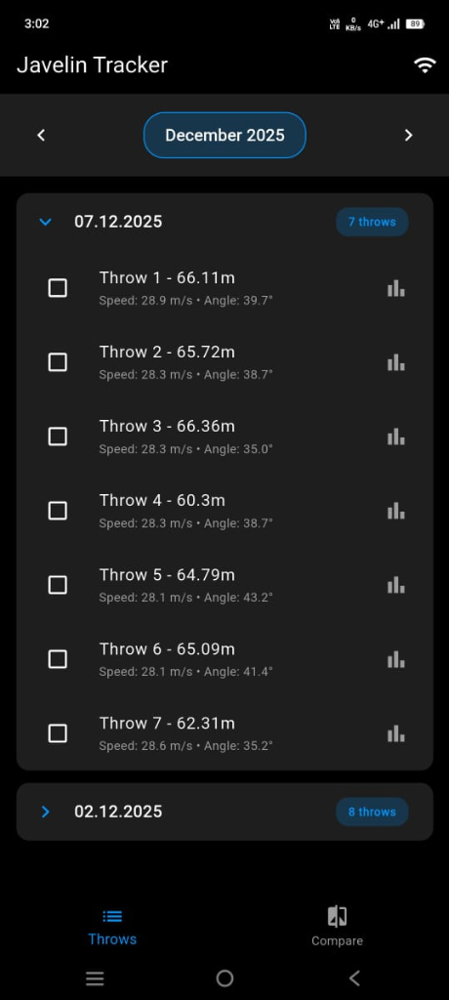
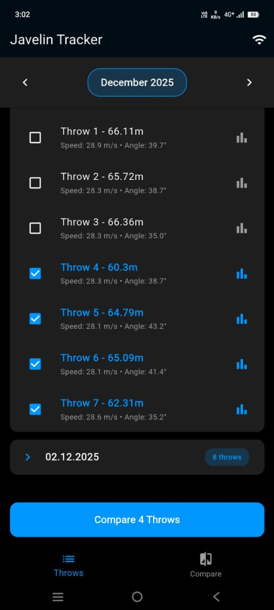
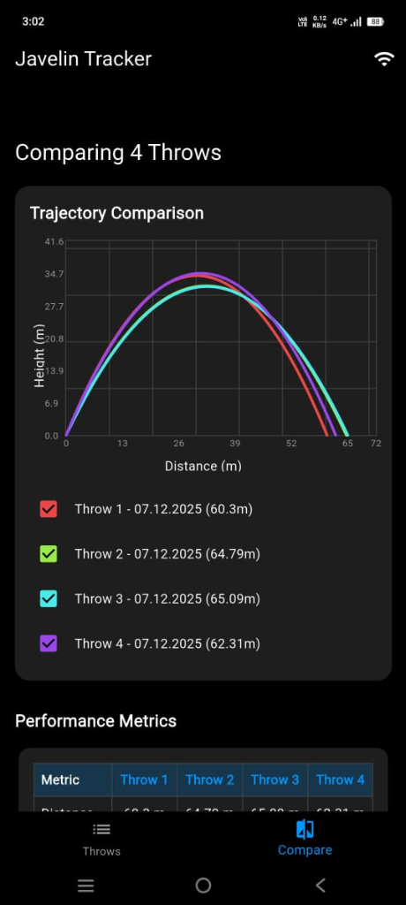
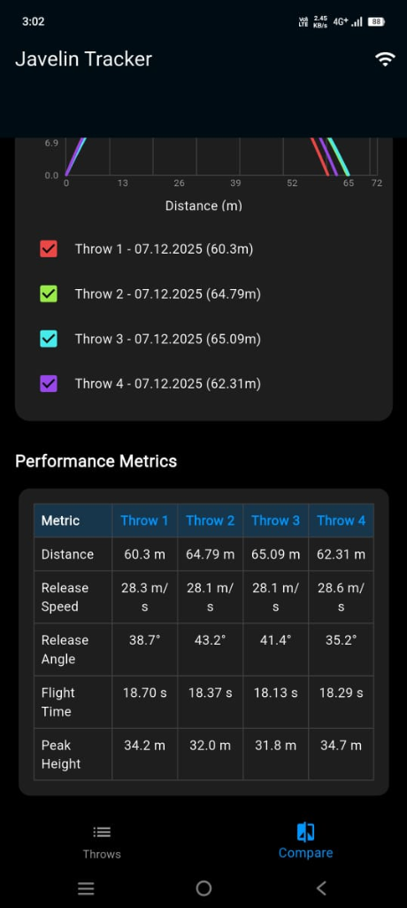

<p align="center">
  
</p>

<h1 align="center">🏃 Javelin Tracker</h1>

<p align="center">
  <strong>A high-performance Flutter application for tracking, analyzing, and visualizing javelin throws using ESP32 Wi-Fi sensors.</strong>
</p>

<p align="center">
  
  
  
  
</p>

---

## 📖 Overview

**Javelin Tracker** is a comprehensive sports analytics application designed for javelin athletes and coaches. It connects wirelessly to ESP32-based sensors attached to the javelin to capture real-time motion data during throws. The app processes this sensor data to compute key performance metrics and generate detailed trajectory visualizations.

---

## 📸 Screenshots

<p align="center">
  
  &nbsp;&nbsp;&nbsp;
  
  &nbsp;&nbsp;&nbsp;
  
  &nbsp;&nbsp;&nbsp;
  
</p>

<p align="center">
  <em>Throws List • Throw Selection • Trajectory Comparison • Performance Metrics</em>
</p>

---

## ✨ Features

| Feature | Description |
|---------|-------------|
| 📡 **Wi-Fi Connectivity** | Scan and connect to ESP32 devices running as access points |
| 🔄 **Auto-Sync** | Automatically download CSV sensor data from `http://192.168.4.1/files` |
| ✅ **Data Validation** | Validates CSV schema and skips incompatible/corrupted files |
| 📊 **Throw Analysis** | Detects individual throws, computes metrics (Distance, Height, Speed, Angle) |
| 📈 **Trajectory Visualization** | Interactive Distance vs Height graphs with trajectory points |
| 🏆 **Performance Comparison** | Compare multiple throws side-by-side with detailed metrics |
| 📋 **Metrics Dashboard** | View Distance, Release Speed, Release Angle, Flight Time, Peak Height |
| 💾 **Local Storage** | Persists datasets and analysis results locally for offline access |

---

## 🛠️ Tech Stack

| Category | Technology |
|----------|------------|
| **Framework** | Flutter 3.x |
| **Language** | Dart |
| **State Management** | Provider |
| **Charts** | fl_chart |
| **Network** | http, wifi_scan, wifi_iot, connectivity_plus |
| **Storage** | shared_preferences, path_provider |
| **Data Processing** | csv, vector_math |
| **Permissions** | permission_handler |

---

## 📁 Project Structure

```
javelin_tracker/
├── lib/
│   ├── main.dart                 # App entry point & theme configuration
│   ├── data/                     # Data layer
│   ├── models/                   # Data models
│   │   ├── dataset.dart          # Dataset model
│   │   ├── javelin_throw.dart    # Throw model with metrics
│   │   └── sensor_sample.dart    # Raw sensor data model
│   ├── providers/                # State management
│   │   ├── dataset_provider.dart # Dataset state management
│   │   ├── wifi_service_provider.dart # Wi-Fi connection logic
│   │   └── throw_selection_provider.dart # UI selection state
│   ├── screens/                  # App screens
│   │   ├── throws_screen.dart    # Main throws list
│   │   ├── compare_screen.dart   # Throw comparison/leaderboard
│   │   ├── graph_screen.dart     # Trajectory visualization
│   │   ├── projectile_screen.dart # Projectile analysis
│   │   └── analytics_comparison_screen.dart # Analytics view
│   ├── services/                 # Business logic
│   │   ├── file_service.dart     # Local file operations
│   │   ├── trajectory_analyzer.dart # Physics calculations
│   │   ├── trajectory_service.dart # Trajectory processing
│   │   └── wifi_download_service.dart # HTTP & parsing
│   ├── utils/                    # Utility functions
│   └── widgets/                  # Reusable UI components
├── assets/
│   ├── images/                   # App icons and images
│   └── screenshots/              # App screenshots
├── test_data/                    # Sample CSV datasets for testing
├── android/                      # Android platform files
├── ios/                          # iOS platform files
├── windows/                      # Windows platform files
├── macos/                        # macOS platform files
├── linux/                        # Linux platform files
└── web/                          # Web platform files
```

---

## 🚀 Getting Started

### Prerequisites

- **Flutter SDK** (3.x stable or higher)
- **VS Code** or **Android Studio** with Flutter plugin
- **Android device** (for full Wi-Fi connectivity features)
- **Windows/macOS/Linux** (for desktop testing)

### Installation

1. **Clone the repository**
   ```bash
   git clone https://github.com/your-username/javelin-tracker.git
   cd javelin-tracker
   ```

2. **Install dependencies**
   ```bash
   flutter pub get
   ```

3. **Run on your target platform**

   #### 📱 Android
   ```bash
   flutter run -d <device-id>
   ```
   > ✅ Android supports in-app connection to the ESP32 network.

   #### 🖥️ Windows
   ```bash
   flutter config --enable-windows-desktop
   flutter run -d windows
   ```
   > ⚠️ Windows requires manual Wi-Fi connection via OS settings. Use "Manual Connect" in the app after connecting.

   #### 🍎 macOS
   ```bash
   flutter config --enable-macos-desktop
   flutter run -d macos
   ```

   #### 🐧 Linux
   ```bash
   flutter config --enable-linux-desktop
   flutter run -d linux
   ```

---

## 📋 Usage Guide

### 1️⃣ Launch the App
Open the app to see the **Throws** screen - your central hub for all recorded datasets.

<p align="center">
  
</p>

### 2️⃣ Connect to ESP32 Sensor
- Tap the **Wi-Fi icon** in the app bar
- Click **"Rescan"** to find available networks
- Connect to `ESP32-FileServer` network
  - **Android**: Tap "Connect" directly in the app
  - **Windows/macOS**: Connect via OS settings, then use "Manual Connect" with IP `192.168.4.1`

### 3️⃣ Sync Data
- The app automatically syncs CSV files from the sensor
- Watch the status indicator for sync progress
- New datasets appear in the Throws list organized by date

### 4️⃣ Select & Compare Throws
- Tap checkboxes to select multiple throws for comparison
- Click **"Compare X Throws"** button to analyze

<p align="center">
  
</p>

### 5️⃣ View Trajectory Comparison
- Compare trajectory curves side-by-side
- Each throw displayed in a unique color
- View Distance vs Height graph

<p align="center">
  
</p>

### 6️⃣ Analyze Performance Metrics
- View detailed metrics for each throw:
  - **Distance** - Total throw distance
  - **Release Speed** - Initial velocity at release
  - **Release Angle** - Angle at release point
  - **Flight Time** - Total time in air
  - **Peak Height** - Maximum height achieved

<p align="center">
  
</p>

---

## 🏗️ Architecture

```
┌─────────────────────────────────────────────────────────────────┐
│                          UI Layer                                │
│  ┌─────────────┐  ┌────────────────┐  ┌──────────────────────┐  │
│  │ ThrowsScreen│  │ CompareScreen  │  │    GraphScreen       │  │
│  └──────┬──────┘  └───────┬────────┘  └──────────┬───────────┘  │
└─────────┼─────────────────┼──────────────────────┼──────────────┘
          │                 │                      │
┌─────────▼─────────────────▼──────────────────────▼──────────────┐
│                       State Layer (Provider)                     │
│  ┌──────────────────┐  ┌──────────────────┐  ┌────────────────┐ │
│  │ DatasetProvider  │  │WifiServiceProvider│  │ThrowSelection  │ │
│  └────────┬─────────┘  └─────────┬────────┘  │   Provider     │ │
└───────────┼──────────────────────┼───────────┴────────────────┘ │
            │                      │                               
┌───────────▼──────────────────────▼──────────────────────────────┐
│                       Service Layer                              │
│  ┌───────────────┐  ┌────────────────────┐  ┌─────────────────┐ │
│  │  FileService  │  │WifiDownloadService │  │TrajectoryAnalyzer│ │
│  └───────────────┘  └────────────────────┘  └─────────────────┘ │
└─────────────────────────────────────────────────────────────────┘
            │                      │
┌───────────▼──────────────────────▼──────────────────────────────┐
│                        Data Layer                                │
│  ┌───────────────┐  ┌─────────────────┐  ┌───────────────────┐  │
│  │    Dataset    │  │   JavelinThrow  │  │   SensorSample    │  │
│  └───────────────┘  └─────────────────┘  └───────────────────┘  │
└─────────────────────────────────────────────────────────────────┘
```

### Key Components

| Component | Responsibility |
|-----------|----------------|
| **DatasetProvider** | Manages throw datasets and UI state |
| **WifiServiceProvider** | Handles Wi-Fi scanning and connection logic |
| **WifiDownloadService** | HTTP requests and CSV parsing |
| **FileService** | Local file operations and persistence |
| **TrajectoryAnalyzer** | Physics calculations and throw detection |

---

## ⚠️ Platform Limitations

| Platform | Limitation | Workaround |
|----------|------------|------------|
| **Windows** | Programmatic Wi-Fi connection restricted | Use "Manual Connect" after connecting via OS settings |
| **iOS** | Similar restrictions to Windows | Connect via Settings app, then use manual mode |
| **macOS** | Wi-Fi API limitations | Manual connection required |
| **Web** | No direct Wi-Fi access | Use test data or manual file import |

---

## 🧪 Testing

### Test Checklist

- [ ] **App Launch**: Verify "Throws" screen loads correctly
- [ ] **Wi-Fi Scan**: Click Wi-Fi icon → Rescan → Networks appear
- [ ] **Connect**: Connect to ESP32 network (method varies by platform)
- [ ] **Sync**: Verify "Syncing files..." status and datasets appear
- [ ] **Selection**: Select multiple throws using checkboxes
- [ ] **Comparison**: Compare throws and view trajectory graph
- [ ] **Metrics**: Verify Distance, Speed, Angle, Flight Time, Peak Height
- [ ] **Delete**: Dataset removal works correctly

### Test Data
The `test_data/` directory contains sample CSV files for testing without a physical ESP32 device.

---

## 🤝 Contributing

Contributions are welcome! Please feel free to submit a Pull Request.

1. Fork the repository
2. Create your feature branch (`git checkout -b feature/AmazingFeature`)
3. Commit your changes (`git commit -m 'Add some AmazingFeature'`)
4. Push to the branch (`git push origin feature/AmazingFeature`)
5. Open a Pull Request

---

## 📄 License

This project is open source and available under the [MIT License](LICENSE).

---

## 📬 Contact

For questions, suggestions, or feedback, please open an issue or reach out via the repository.

---

<p align="center">
  
</p>
